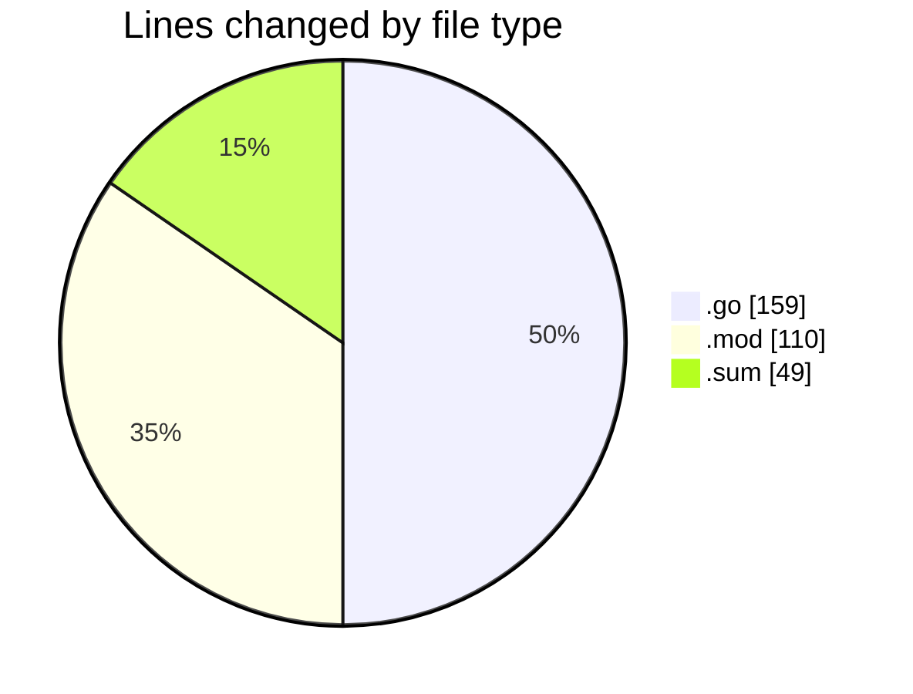
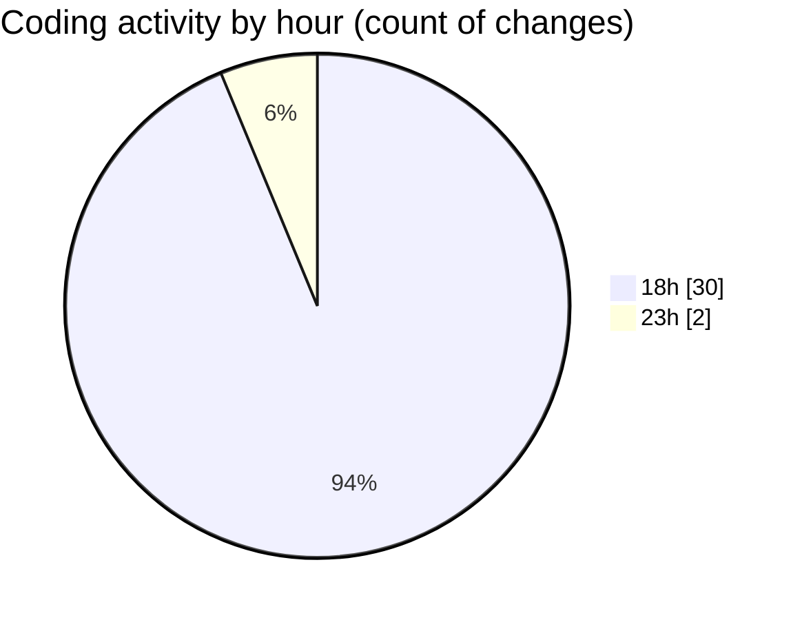

# backend - Activity Summary 

## Overall Statistics

| Stat                   | Value                                                             |
| ---------------------- | ----------------------------------------------------------------- |
| **Lines Added** (➕)   | 267                                          |
| **Lines Removed** (➖) | 51                                        |
| **Net Change** (↕)    | 216                |
| **Active Time** (⌚)   | 36 minutes |

## Modified Files
- **handler.go** (+64, -0)
- **main.go** (+53, -0)
- **config.go** (+31, -0)
- **logger.go** (+11, -0)
- **go.mod** (+59, -51)
- **go.sum** (+49, -0)

## Visualizations

### By File Type (Lines Changed)

### By Hour (Estimated Activity Count)

> **Last Updated:** 11/1/2025, 6:45:55 PM