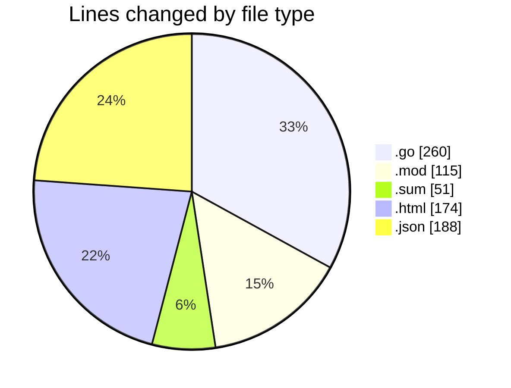
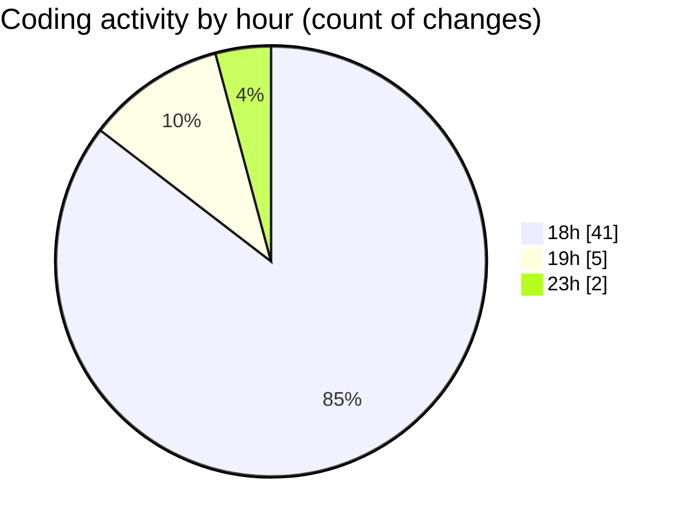

# backend - Activity Summary 

## Overall Statistics

| Stat                   | Value                                                             |
| ---------------------- | ----------------------------------------------------------------- |
| **Lines Added** (➕)   | 702                                          |
| **Lines Removed** (➖) | 86                                        |
| **Net Change** (↕)    | 616                |
| **Active Time** (⌚)   | 50 minutes |

## Modified Files
- **handler.go** (+81, -22)
- **main.go** (+53, -6)
- **config.go** (+31, -4)
- **logger.go** (+11, -0)
- **go.mod** (+61, -54)
- **go.sum** (+51, -0)
- **test.html** (+174, -0)
- **settings.json** (+188, -0)
- **parser.go** (+23, -0)
- **validator.go** (+29, -0)

## Visualizations

### By File Type (Lines Changed)

### By Hour (Estimated Activity Count)

> **Last Updated:** 11/1/2025, 7:10:55 PM