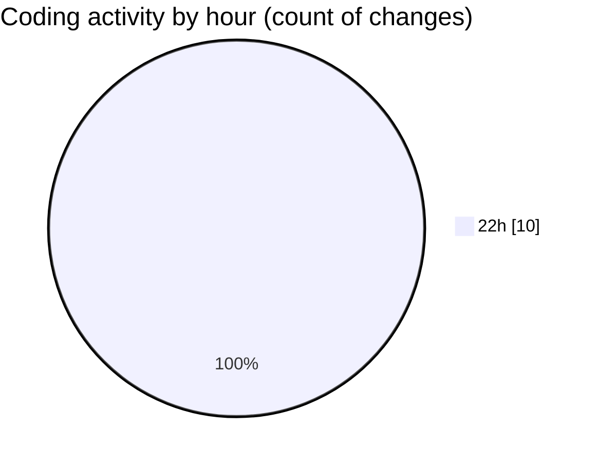

# backend - Activity Summary 

## Overall Statistics

| Stat                   | Value                                                             |
| ---------------------- | ----------------------------------------------------------------- |
| **Lines Added** (➕)   | 241                                          |
| **Lines Removed** (➖) | 0                                        |
| **Net Change** (↕)    | 241                |
| **Active Time** (⌚)   | 11 minutes |

## Modified Files
- **type.go** (+26, -0)
- **optimizer.go** (+51, -0)
- **service.go** (+43, -0)
- **handler.go** (+70, -0)
- **main.go** (+51, -0)

## Visualizations

### By File Type (Lines Changed)

### By Hour (Estimated Activity Count)

> **Last Updated:** 11/3/2025, 10:07:36 PM