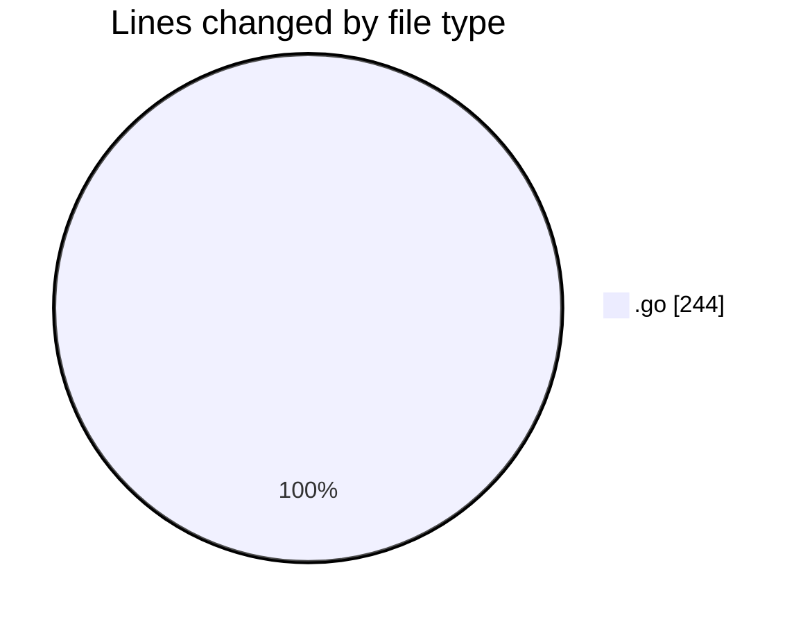
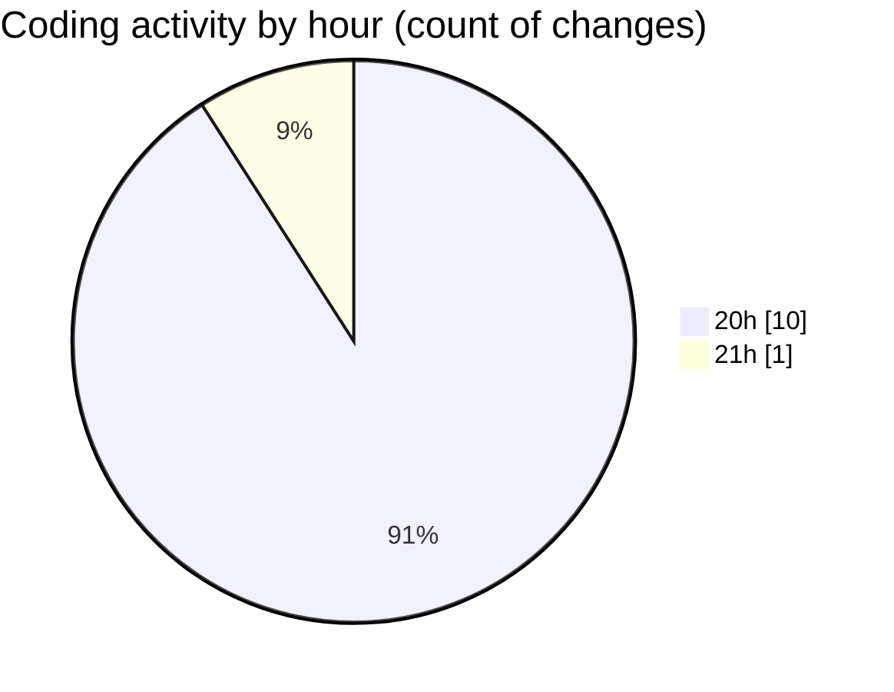

# backend - Activity Summary 

## Overall Statistics

| Stat                   | Value                                                             |
| ---------------------- | ----------------------------------------------------------------- |
| **Lines Added** (➕)   | 232                                          |
| **Lines Removed** (➖) | 12                                        |
| **Net Change** (↕)    | 220                |
| **Active Time** (⌚)   | 14 minutes |

## Modified Files
- **main.go** (+52, -0)
- **type.go** (+25, -0)
- **optimizer.go** (+60, -12)
- **handler.go** (+95, -0)

## Visualizations

### By File Type (Lines Changed)

### By Hour (Estimated Activity Count)

> **Last Updated:** 11/25/2025, 9:22:06 PM