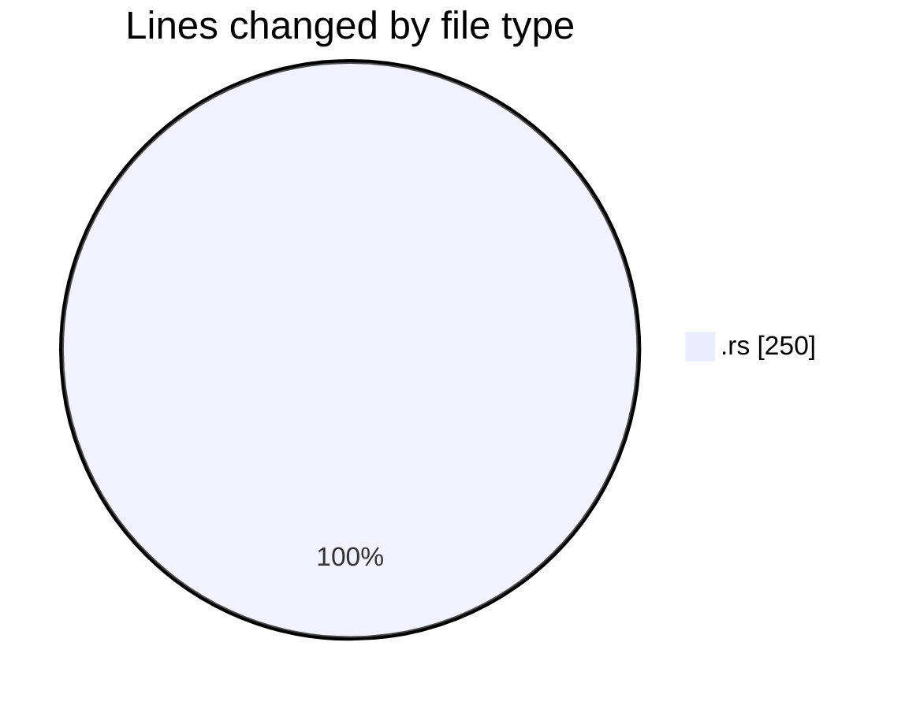
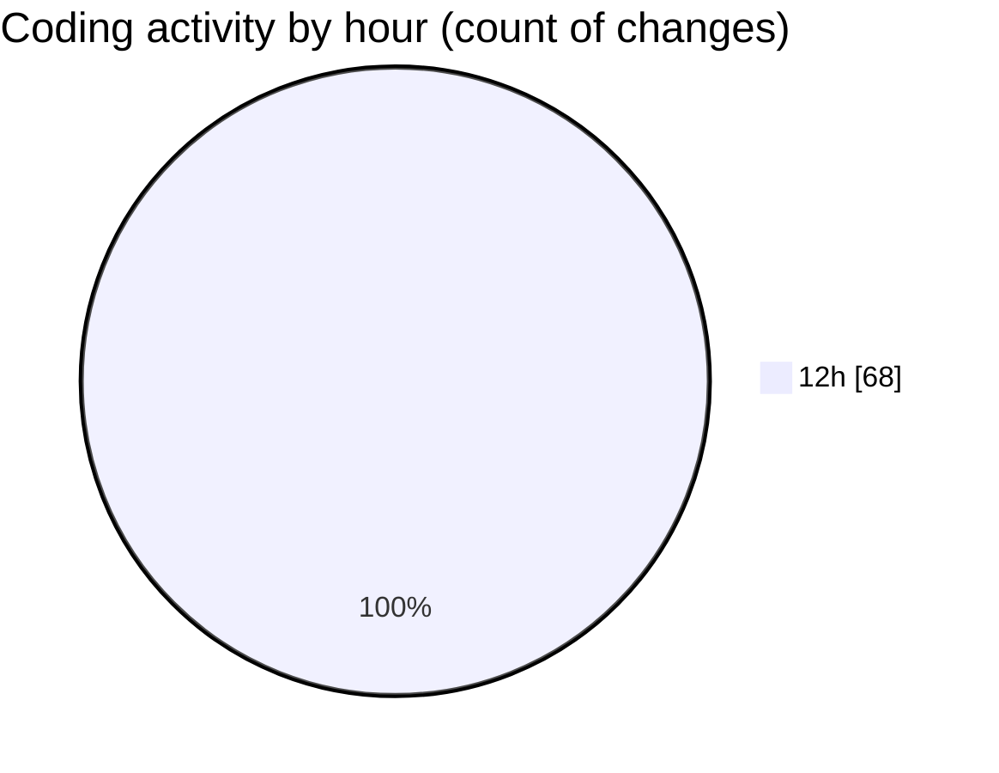

# Rust - Activity Summary 

## Overall Statistics

| Stat                   | Value                                                             |
| ---------------------- | ----------------------------------------------------------------- |
| **Lines Added** (➕)   | 144                                          |
| **Lines Removed** (➖) | 106                                        |
| **Net Change** (↕)    | 38                |
| **Active Time** (⌚)   | 97 minutes |

## Modified Files
- **main.rs** (+144, -106)

## Visualizations

### By File Type (Lines Changed)

### By Hour (Estimated Activity Count)

> **Last Updated:** 12/28/2025, 12:56:41 PM