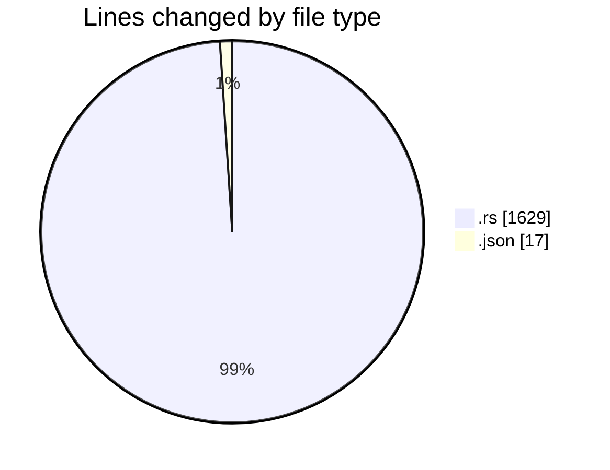
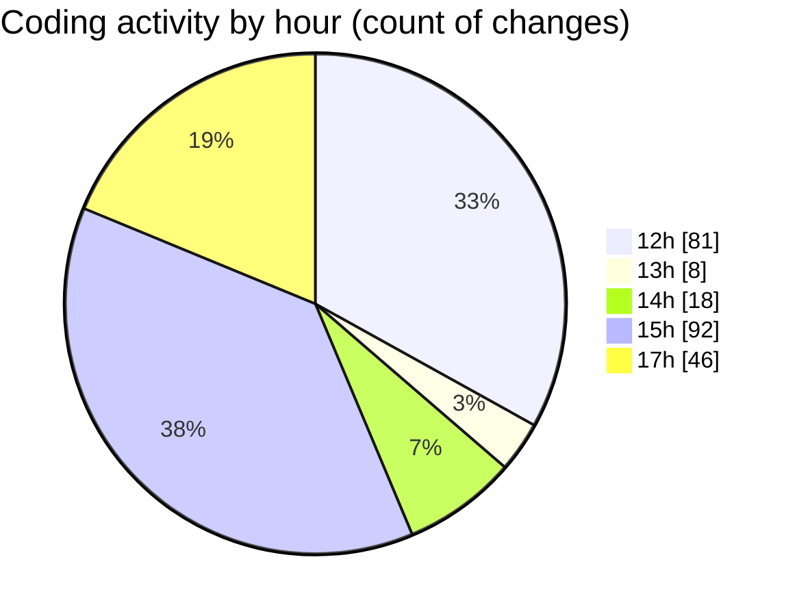

# Rust - Activity Summary 

## Overall Statistics

| Stat                   | Value                                                             |
| ---------------------- | ----------------------------------------------------------------- |
| **Lines Added** (➕)   | 916                                          |
| **Lines Removed** (➖) | 730                                        |
| **Net Change** (↕)    | 186                |
| **Active Time** (⌚)   | 288 minutes |

## Modified Files
- **main.rs** (+903, -726)
- **keybindings.json** (+13, -4)

## Visualizations

### By File Type (Lines Changed)

### By Hour (Estimated Activity Count)

> **Last Updated:** 12/28/2025, 5:20:53 PM