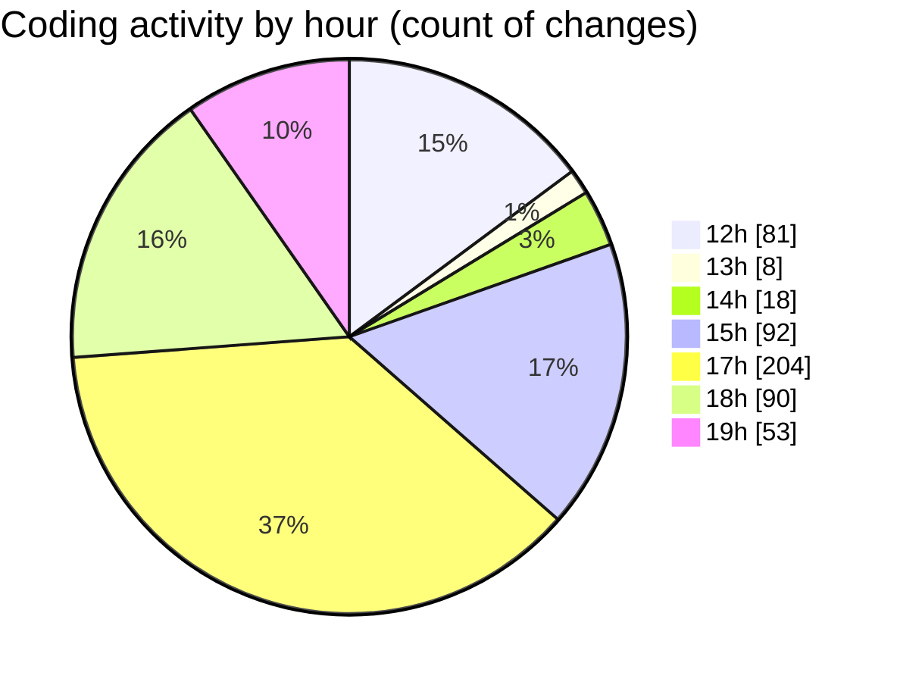

# Rust - Activity Summary 

## Overall Statistics

| Stat                   | Value                                                             |
| ---------------------- | ----------------------------------------------------------------- |
| **Lines Added** (➕)   | 2316                                          |
| **Lines Removed** (➖) | 1922                                        |
| **Net Change** (↕)    | 394                |
| **Active Time** (⌚)   | 637 minutes |

## Modified Files
- **main.rs** (+2141, -1820)
- **keybindings.json** (+13, -4)
- **guessing_game.rs** (+107, -59)
- **second_largest.rs** (+55, -39)

## Visualizations

### By File Type (Lines Changed)

### By Hour (Estimated Activity Count)

> **Last Updated:** 12/28/2025, 7:26:29 PM