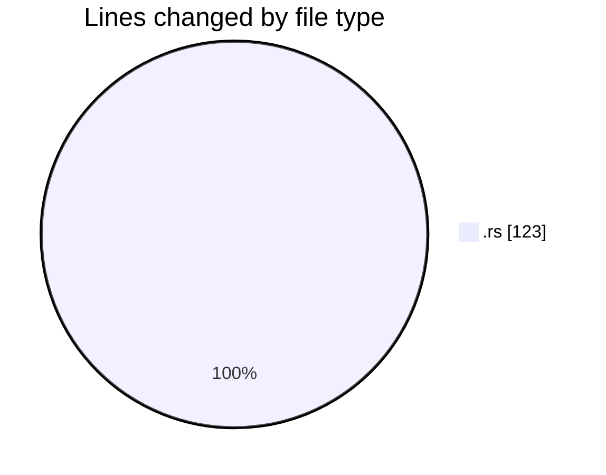
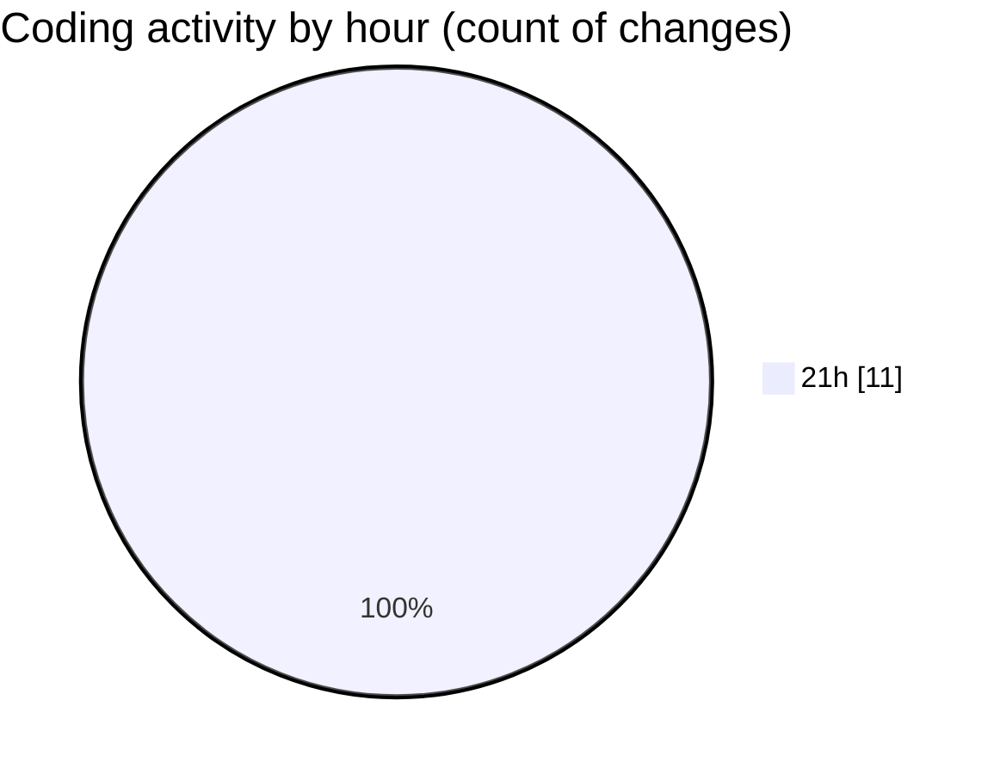

# Rust - Activity Summary 

## Overall Statistics

| Stat                   | Value                                                             |
| ---------------------- | ----------------------------------------------------------------- |
| **Lines Added** (➕)   | 118                                          |
| **Lines Removed** (➖) | 5                                        |
| **Net Change** (↕)    | 113                |
| **Active Time** (⌚)   | 10 minutes |

## Modified Files
- **main.rs** (+118, -5)

## Visualizations

### By File Type (Lines Changed)

### By Hour (Estimated Activity Count)

> **Last Updated:** 12/29/2025, 9:19:43 PM